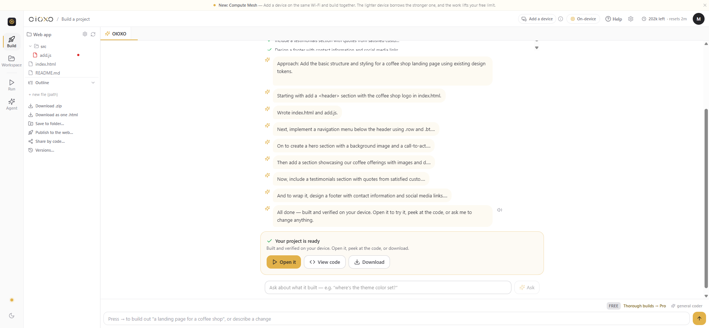
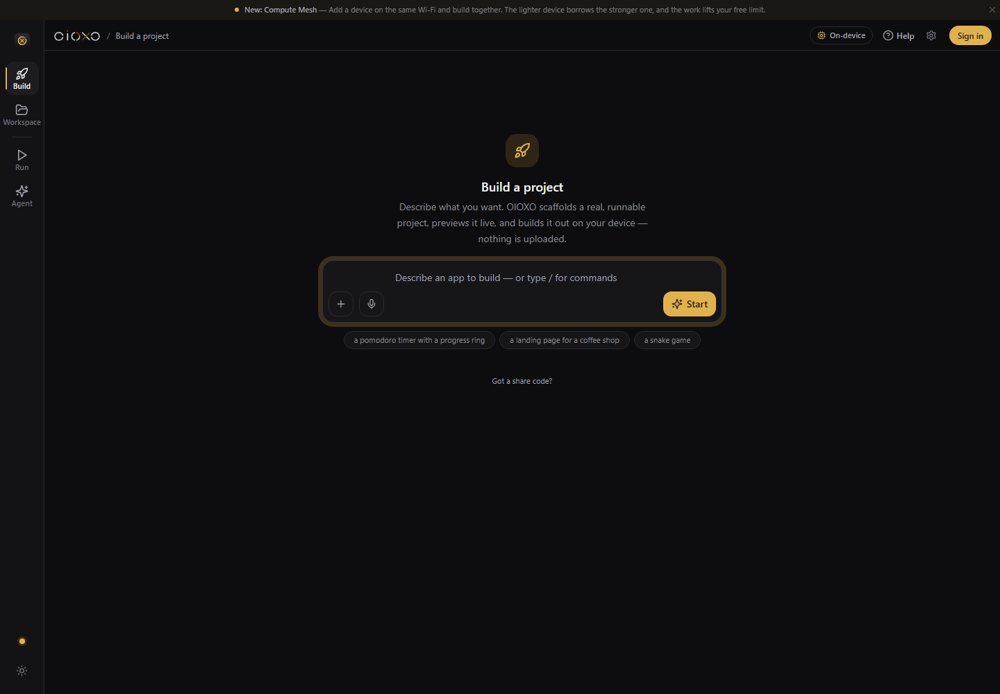

<div align="center">


# OIOXO

### Describe it. Watch it build. On your device.

**OIOXO is an in-browser AI IDE.** Write a prompt, and it scaffolds a real, runnable
project — generated, run, and *verified by actually executing it* — entirely on your own
machine. Nothing touches our servers.

[**Open the IDE →**](https://oioxo.com/oioxo) &nbsp;·&nbsp;
[Download](https://oioxo.com/download) &nbsp;·&nbsp;
[Guides](https://oioxo.com/docs) &nbsp;·&nbsp;
[Pricing](https://oioxo.com/pricing)

<br/>


</div>

---

## Why OIOXO is different

Most AI coding tools send your code to a server, run a model in someone else's data
center, and bill you per token. OIOXO runs the model **in your browser** on **your**
GPU (WebGPU / WASM). Your code never leaves your device, it works offline once loaded,
and the first tier is free forever — no card.

> **Verified, not just generated.** OIOXO doesn't stop at writing code. It runs a
> plan → write → run → repair loop that *executes* what it built and fixes it until it
> actually works. The check mark means it ran, not that it looked right.

|  |  |
| --- | --- |
| 🔒 **Your code never leaves your device** | The model runs locally. No upload, no proxy, no telemetry on your source. |
| ⚡ **Verified by execution** | Plan → write → run → repair. OIOXO runs your project and repairs it until it passes. |
| 💸 **Forever free to start** | A genuine free tier with on-device compute — no credit card, no trial clock. |
| 🌐 **Everywhere you build** | Web, desktop (Win/Mac/Linux), mobile (iOS/Android), CLI, and a VS Code extension — one account. |
| 🔌 **Bring your own key** | Prefer a frontier model? Plug in any of 12+ providers — or local Ollama — anytime. |
| 📡 **Compute Mesh** | Pair two devices over Wi‑Fi with a QR code; the lighter device borrows the stronger one. Serverless. |

---

## Get OIOXO

| Surface | What it is | Get it |
| --- | --- | --- |
| **Web IDE** | The full IDE in any modern browser. No install. | [Open the IDE](https://oioxo.com/oioxo) |
| **Desktop app** `v1.99.6` | Native Windows · macOS · Linux. Bigger models, full file‑system access, background agents. | [Download for your OS](https://oioxo.com/download) |
| **Mobile** | The full IDE, tuned for touch, on iOS & Android. | [Open on mobile](https://oioxo.com/oioxo) |
| **CLI** | A terminal coding agent + context engine. Cuts editor token use by ~90%. | `npx oioxo-mcp@latest` &nbsp;·&nbsp; [npm](https://www.npmjs.com/package/oioxo-mcp) |
| **VS Code extension** | OIOXO inside your editor — on‑device chat, context engine, token‑saver. | [Marketplace](https://marketplace.visualstudio.com/items?itemName=oioxo.oioxo-vscode) |

Every platform and release, auto‑detected for your OS, lives at
**[oioxo.com/download](https://oioxo.com/download)**.

---

## How it works

**1 · Describe it.** One sentence — "a landing page for a coffee shop," "a REST API with
auth," "a snake game." OIOXO turns it into a concrete build plan.

**2 · Watch it build.** The model writes the project step by step, narrating as it goes.
You can steer it mid‑build — the redirect folds into the next step.

**3 · It runs and repairs.** OIOXO executes the project on your device, catches what
breaks, and fixes it until it passes. You get a working project, not a guess.

---

## Screenshots

| Build surface | Dark mode |
| --- | --- |
|  |  |

---

## Quick start

**Web** — nothing to install:

```
Open https://oioxo.com/oioxo  →  type a prompt  →  press Start
```

**CLI** — a terminal coding agent + context engine:

```bash
npx oioxo-mcp@latest          # run instantly
oioxo code "fix the failing test in src/cart.js"
```

**Bring your own key** (optional) — frontier models from 12+ providers, or local Ollama,
configured in Settings → *How the AI runs*.

---

## Privacy & trust

- **On‑device runtime.** The coding model runs in your browser over WebGPU/WASM. Your
  source is processed locally.
- **No source upload.** OIOXO does not proxy your code through our servers to run it.
- **Open about limits.** Read what we collect and why in the
  [Privacy Policy](https://oioxo.com/privacy) and [Terms](https://oioxo.com/terms).

---

## Links

[Website](https://oioxo.com) ·
[Open the IDE](https://oioxo.com/oioxo) ·
[Download](https://oioxo.com/download) ·
[Docs & guides](https://oioxo.com/docs) ·
[Pricing](https://oioxo.com/pricing) ·
[Privacy](https://oioxo.com/privacy) ·
[Terms](https://oioxo.com/terms)

<div align="center">
<br/>

**Build something in the next minute — on your device.**

[**Start building — free →**](https://oioxo.com/oioxo)

<sub>© OIOXO. Your code never leaves your device.</sub>

</div>
