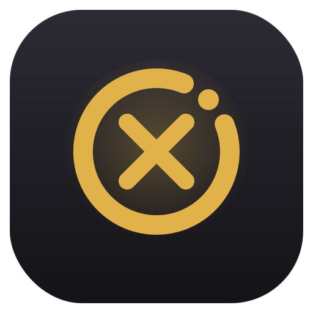

<div align="center">



# OIOXO

### Describe an app. Watch it build itself. On your own device.

**OIOXO is a private AI that builds real apps for you.** Tell it what you want in one
sentence — it writes the code, **runs it, and fixes it until it works** — all on your own
computer or phone. Your code never leaves your device. It's free to start, and it can cut your
AI costs by up to 90%.

[**Start building — free →**](https://oioxo.com/oioxo) &nbsp;·&nbsp;
[Download](https://oioxo.com/download) &nbsp;·&nbsp;
[Guides](https://oioxo.com/docs) &nbsp;·&nbsp;
[Pricing](https://oioxo.com/pricing)

<br/>


</div>

---

## Why people love it

Three things make OIOXO different — and they're the kind you feel on day one.

### 🔒 Your code stays private
The AI runs on **your own computer or phone**, not on our servers. So nothing you write or
ask ever gets uploaded. Privacy isn't a setting you switch on — it's just how it's built.
The only thing we ever count is *how much* you've used, never *what* you made.

### 💸 It can cut your AI bill by up to 90% — even in the tools you already use
AI assistants charge you by the word, and they read far more of your project than they need.
OIOXO hands the AI only the small slice that's actually relevant — same answer, a fraction of
the cost. A question that would cost ~50,000 words comes back as ~5,000.

And you don't have to switch tools. One small install plugs OIOXO into **GitHub Copilot,
Cursor, Claude, Windsurf** and more — your existing setup, up to ~90% cheaper.

```bash
npx oioxo-mcp@latest
```

### 🤝 Your devices team up to build together
Put two of your own devices on the **same Wi-Fi** and they work on the same project together.
The weaker one borrows the stronger one's power — so your old phone can build like a fast
laptop. Best part: the time your devices spend helping each other adds **free build time** to
your account.

- One button — **"Add a device"**: show a code on one device, scan it on the other
- Your own devices, on your own Wi-Fi — never a stranger's
- They talk to each other directly — nothing goes through us
- Stop helping anytime; your project always stays safe on the main device

*(Feature name: Compute Mesh.)*

---

## And it actually finishes the job

OIOXO doesn't just write code and hope. It **runs the app, catches what breaks, and fixes it
until it actually works.** The check mark means it ran — not that it looked right.

| | |
| --- | --- |
| **Real apps, not snippets** | Plan → write → run → repair, until it works — with a live preview. |
| **Use your own AI key** | Bring Claude, OpenAI & 12+ providers, or run a model locally with Ollama. Free for everyone. |
| **Free to run** | Using the AI is always free. Pay only for more time — Pro is **$3.99/mo**. |
| **Everywhere you build** | Browser, computer (Win/Mac/Linux), phone, terminal, and inside VS Code — one account. |

---

## Get OIOXO

| Where | What it is | Get it |
| --- | --- | --- |
| **In your browser** | Nothing to install. Just open it and build. | [Open OIOXO](https://oioxo.com/oioxo) |
| **On your computer** `v1.99.6` | A full app for Windows, Mac & Linux — more powerful, works with your files. | [Download](https://oioxo.com/download) |
| **On your phone** | The full thing, made for touch, on iPhone & Android. | [Open on your phone](https://oioxo.com/oioxo) |
| **In the terminal** | A coding helper for your command line — and the up-to-~90% cost saver. | `npx oioxo-mcp@latest` · [npm](https://www.npmjs.com/package/oioxo-mcp) |
| **Inside VS Code** | OIOXO right in your editor — private chat + the cost saver. | [Marketplace](https://marketplace.visualstudio.com/items?itemName=oioxo.oioxo-vscode) |

Everything for every device lives at **[oioxo.com/download](https://oioxo.com/download)**.

---

## How it works

**1 · Tell it what you want.** One sentence — "a landing page for a coffee shop," "a to-do
app," "a snake game." Or open a project you already have and ask for a change.

**2 · Watch it build.** OIOXO plans it, writes the code, runs it, and fixes its own mistakes —
right on your device, telling you what it's doing as it goes. You can change your mind
mid-build, and it follows.

**3 · Use it & share it.** Preview it, tweak it by just talking to it, then put it online in
one click or send the whole project as a single code. Your work never left your machine.

---

## Common questions

**Does my code really stay on my device?**
Yes. The AI runs on your own computer or phone — not on our servers. The only thing we count is
*how much* you've used (a number), never the code itself. It's never uploaded.

**Is it actually free?**
Free to start — no card, no countdown. Using the AI models is always free. If you want
unlimited time, Pro is $3.99/month, but the models stay free either way.

**How do my devices "build together"?**
Put two of your own devices on the same Wi-Fi, tap "Add a device," and scan a code. Now they
work on one project, and the weaker one borrows the stronger one's power — earning you free
build time. They talk directly; nothing goes through us.

**Can I use my own AI (like Claude or OpenAI)?**
Yes — plug in your key from 12+ providers, or run a model locally with Ollama. Free for
everyone, and OIOXO still trims the bill by up to ~90%.

---

## Links

[Website](https://oioxo.com) ·
[Start building](https://oioxo.com/oioxo) ·
[Download](https://oioxo.com/download) ·
[Guides](https://oioxo.com/docs) ·
[Pricing](https://oioxo.com/pricing) ·
[Privacy](https://oioxo.com/privacy) ·
[Terms](https://oioxo.com/terms)

<div align="center">
<br/>

**Build something in the next minute — on your own device.**

[**Start building — free →**](https://oioxo.com/oioxo)

<sub>© OIOXO. Your code never leaves your device.</sub>

</div>
